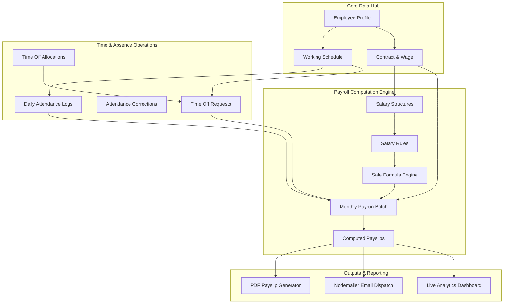

# 🌐 PeoplePay360 — Integrated HR & Payroll Operations Platform

[](https://nodejs.org/)
[](https://expressjs.com/)
[](https://react.dev/)
[](https://vitejs.dev/)
[](https://www.mongodb.com/)
[](https://tailwindcss.com/)
[](https://redux-toolkit.js.org/)
[](LICENSE)

> **PeoplePay360** is a modern, enterprise-grade **Human Resource & Payroll Management System** built for the **Odoo Hackathon 2026** problem statement (*"PeoplePay360: HR & Payroll — An Integrated Human Resource and Payroll Operations Platform"*).
>
> Unlike fragmented HR tools with disconnected CRUD screens, PeoplePay360 treats the **Employee record as the single operational source of truth**, linking organizational profiles, historical contracts, working schedules, biometric-style attendance, leave allocations, dynamic formula-driven salary structures, automated batch payruns, PDF payslip generation, and real-time executive analytics into a unified workflow.

---

## 📑 Table of Contents

- [Key Highlights & Core Capabilities](#-key-highlights--core-capabilities)
- [System Architecture & Operational Flow](#-system-architecture--operational-flow)
- [Complete Folder & Project Structure](#-complete-folder--project-structure)
  - [Root Level Structure](#root-level-structure)
  - [Backend Architecture (`backend/`)](#backend-architecture-backendsrc)
  - [Frontend Architecture (`frontend/`)](#frontend-architecture-frontendsrc)
  - [Documentation Suite (`docs/`)](#documentation-suite-docs)
- [Role-Based Access Control (RBAC) Matrix](#-role-based-access-control-rbac-matrix)
- [Technology Stack](#-technology-stack)
- [Getting Started & Installation](#-getting-started--installation)
  - [Prerequisites](#1-prerequisites)
  - [Backend Setup](#2-backend-setup)
  - [Frontend Setup](#3-frontend-setup)
  - [Database Seeding](#4-database-seeding)
- [Demo Credentials](#-demo-credentials)
- [API Endpoints Overview](#-api-endpoints-overview)
- [Testing & Quality Verification](#-testing--quality-verification)
- [Documentation Index](#-documentation-index)

---

## 🚀 Key Highlights & Core Capabilities

### 👥 1. Centralized Employee Master Data
- Unified employee profiles with department, job position, manager hierarchy, and employment status.
- Linked bank details, contact information, emergency contacts, and working calendar associations.

### 📑 2. Contract Management
- Tracks contract history, active employment contracts, wage definitions (`wagePerMonth`), salary structure bindings, and working schedules.
- Automatic contract validation preventing overlapping active contracts and ensuring payroll calculation accuracy.

### ⏰ 3. Working Schedules & Shifts
- Configurable shift definitions with day-of-week active hours, lunch breaks, and total planned weekly hours.
- Drives working day counts, absence calculations, and attendance expectations dynamically.

### ⏱️ 4. Attendance & Time Tracking
- Daily Check-In / Check-Out logging with automatic calculation of worked hours, overtime, and late arrivals.
- Employee attendance correction requests with multi-tier managerial approval workflows.

### 🌴 5. Time Off & Leave Allocations
- Flexible leave types (Paid Time Off, Sick Leave, Unpaid Leave) with allocation quotas per employee.
- Multi-state request lifecycle (`Draft` ➔ `Pending Approval` ➔ `Approved` / `Refused`).
- Intelligent working schedule calendar exclusions (weekends and non-working days automatically excluded from leave deductions).

### ⚙️ 6. Configurable Salary Structures & Safe Formula Engine
- Multi-component salary rules: Basic, HRA, DA, Conveyance, Allowances, PF, Tax, and Unpaid Leave Deductions.
- **Safe expression engine** supporting mathematical expressions, conditional `IF(...)`, `MIN(...)`, `MAX(...)`, and parameter references (zero `eval()`, zero arbitrary code injection).
- Dependency-ordered rule computation adhering strictly to salary structure rules hierarchy.

### 💰 7. Batch Payroll & Payrun Lifecycle
- Automated monthly payrun creation with batch employee resolution.
- Status-gated workflow transitions: `Draft` ➔ `Review` ➔ `Approved` ➔ `Paid`.
- **Immutable Payslip Snapshots**: Computed payslips freeze salary rule lines to protect historical financial integrity against retroactive rule modifications.

### 📄 8. Automated PDF Payslips & Email Delivery
- Crisp, pixel-perfect PDF payslip generation powered by `PDFKit`.
- Direct email delivery of PDF payslips to employees via `Nodemailer` with SMTP integration.

### 📊 9. Real-Time Payroll & HR Analytics Dashboard
- Interactive visualizations powered by `Recharts`: total salary expenditure, department distributions, attendance compliance KPIs, leave balance statuses, and monthly cost trends.

### 🔒 10. Robust Multi-Role RBAC & Session Security
- Five distinct canonical roles (`Admin`, `HR Manager`, `HR Payroll Manager`, `HR Payroll User`, `Employee`).
- Secure session-based authentication using `Passport.js`, `express-session`, and `connect-mongo`.
- Zero password hash leakage across all public/private API surfaces.

---

## 🏗 System Architecture & Operational Flow



---

## 📂 Complete Folder & Project Structure

### Root Level Structure

```text
odoo_final/
├── backend/                       # Node.js Express REST API & Database layer
├── frontend/                      # React 19 + Vite Frontend SPA
├── docs/                          # Comprehensive 27-file Architecture & Specs
├── scratch/                       # Ad-hoc audit and verification utilities
├── test_phase17_frontend_integration.js
├── test_phase18_integration.js
├── test_phase19_integration.js
├── test_phase20_integration.js
├── test_phase21_integration.js
├── test_phase22_integration.js
├── test_phase23_integration.js
├── test_phase24_integration.js
├── test_phase25_e2e_scenarios.js   # Master end-to-end integration test suite
├── audit_phase17_strict.js        # Strict RBAC & Data integrity audit runner
├── audit_phase17_report.json      # Output validation reports
├── .gitignore                     # Git ignore rules for node_modules, .env, dist
└── README.md                      # Primary project documentation (this file)
```

---

### Backend Architecture (`backend/src/`)

```text
backend/
├── .env.example                   # Template environment variables
├── package.json                   # Backend dependencies & npm scripts
├── server.js                      # Application entry point & HTTP listener
└── src/
    ├── app.js                     # Express application configuration & middleware setup
    ├── config/                    # Configuration modules
    │   ├── db.js                  # Mongoose connection logic & reconnect handlers
    │   └── passport.js            # Passport LocalStrategy & session serializer/deserializer
    ├── controllers/               # Route request handlers & controllers
    │   ├── attendance.controller.js
    │   ├── auth.controller.js
    │   ├── contracts.controller.js
    │   ├── dashboard.controller.js
    │   ├── departments.controller.js
    │   ├── employees.controller.js
    │   ├── jobPositions.controller.js
    │   ├── payruns.controller.js
    │   ├── payslips.controller.js
    │   ├── salaryRules.controller.js
    │   ├── salaryStructures.controller.js
    │   ├── timeOffAllocations.controller.js
    │   ├── timeOffRequests.controller.js
    │   ├── timeOffTypes.controller.js
    │   ├── users.controller.js
    │   └── workingSchedules.controller.js
    ├── middleware/                # Custom Express Middlewares
    │   ├── auth.middleware.js     # Session verification & authentication guards
    │   ├── errorHandler.js        # Centralized HTTP error handler & formatting
    │   ├── rbac.middleware.js     # Multi-role permission checking (`requireRoles`)
    │   └── validate.middleware.js # Request payload validation helpers
    ├── models/                    # Mongoose Data Models & Schemas
    │   ├── Attendance.js          # Clock in/out, worked hours, correction flags
    │   ├── Contract.js            # Employee wage, salary structure, duration
    │   ├── Department.js          # Organization departments
    │   ├── Employee.js            # Central employee profile & relations
    │   ├── JobPosition.js         # Designations linked to departments
    │   ├── Payrun.js              # Pay period batch record & approval state
    │   ├── Payslip.js             # Detailed line-item salary computation snapshot
    │   ├── SalaryRule.js          # Computation formulas, percentages, fixed amounts
    │   ├── SalaryStructure.js     # Ordered collections of salary rules
    │   ├── TimeOffAllocation.js   # Granted leave quotas per employee/type
    │   ├── TimeOffRequest.js      # Leave requests & approval lifecycle
    │   ├── TimeOffType.js         # Paid, Unpaid, Sick leave configurations
    │   ├── User.js                # Auth credentials, assigned roles & employee link
    │   └── WorkingSchedule.js     # Weekly active days, shift hours & breaks
    ├── routes/                    # Express Router definitions
    │   ├── attendance.routes.js
    │   ├── auth.routes.js
    │   ├── contracts.routes.js
    │   ├── dashboard.routes.js
    │   ├── departments.routes.js
    │   ├── employees.routes.js
    │   ├── jobPositions.routes.js
    │   ├── payruns.routes.js
    │   ├── payslips.routes.js
    │   ├── salaryRules.routes.js
    │   ├── salaryStructures.routes.js
    │   ├── timeOffAllocations.routes.js
    │   ├── timeOffRequests.routes.js
    │   ├── timeOffTypes.routes.js
    │   ├── users.routes.js
    │   └── workingSchedules.routes.js
    ├── services/                  # Business Logic & Core Compute Engines
    │   ├── attendance.service.js  # Hours calculation, overtime & correction logic
    │   ├── email.service.js       # Nodemailer transporter & HTML/PDF email delivery
    │   ├── formulaEngine.js       # Safe mathematical parser for salary rules
    │   ├── payrollCompute.service.js # Payrun processor & payslip generation
    │   ├── pdfGenerator.service.js   # PDFKit invoice/payslip rendering engine
    │   └── workingSchedule.service.js# Calendar days calculation & schedule resolution
    └── utils/                     # Utilities & Seeding Scripts
        ├── constants.js           # System-wide enum values & role definitions
        ├── dateUtils.js           # Date formatting & interval helpers
        └── seed.js                # Full enterprise database seeder script
```

#### Detailed Explanation of Backend Folders:
- **`config/`**: Sets up the persistent MongoDB connection with retry options and configures Passport.js session-based user authentication.
- **`controllers/`**: Isolates HTTP request/response logic. Receives client input, invokes domain services, and returns consistent JSON responses.
- **`middleware/`**: Houses route guards. `rbac.middleware.js` enforces granular role permissions using role unions, while `errorHandler.js` intercepts exceptions to provide clean error responses.
- **`models/`**: Defines strict Mongoose schemas with indexed fields, foreign key references, and schema-level validation constraints.
- **`routes/`**: Maps REST endpoints to their respective controller handlers and binds necessary authentication/RBAC middleware.
- **`services/`**: The heart of the backend logic. `formulaEngine.js` safely computes dynamic salary formulas without vulnerable code execution (`eval`). `payrollCompute.service.js` calculates gross, allowances, tax, PF, and unpaid leave deductions per pay period.
- **`utils/`**: Contains helper functions and `seed.js`, which provisions 10 full employee records, contracts, working schedules, attendance histories, salary rules, and payruns for testing.

---

### Frontend Architecture (`frontend/src/`)

```text
frontend/
├── index.html                     # SPA HTML5 entry point
├── package.json                   # Frontend dependencies & Vite configuration
├── vite.config.js                 # Vite build settings & Tailwind CSS plugins
└── src/
    ├── App.jsx                    # Root React component with routing shell
    ├── main.jsx                   # React 19 DOM bootstrap & Redux Provider
    ├── index.css                  # Tailwind CSS v4 design tokens & base styling
    ├── api/                       # Axios client & API endpoints abstraction
    │   ├── apiClient.js           # Axios instance with credentials & interceptors
    │   └── endpoints.js           # Centralized URL endpoints map
    ├── app/                       # Global State Management
    │   ├── store.js               # Redux Toolkit store configuration
    │   └── rootReducer.js         # Combined feature reducers
    ├── components/                # Shared Reusable UI Components
    │   ├── Navbar.jsx             # Top navigation bar with responsive profile menu
    │   ├── StatCard.jsx           # KPI metrics summary cards
    │   ├── Badge.jsx              # Status badges (Draft, Approved, Paid, etc.)
    │   ├── Modal.jsx              # Accessible modal dialog wrapper
    │   ├── ConfirmDialog.jsx      # Confirmation prompts for destructive actions
    │   ├── Table.jsx              # Paginated data table with sorting and filtering
    │   ├── Loader.jsx             # Spinner and loading state indicators
    │   └── AlertBanner.jsx        # Notification alert banners
    ├── layouts/                   # Layout Wrappers
    │   ├── MainLayout.jsx         # Authenticated app layout (TopNav + Container)
    │   └── AuthLayout.jsx         # Unauthenticated layout for login screen
    ├── routes/                    # Application Routing & Guards
    │   ├── AppRoutes.jsx          # Declarative route configuration
    │   ├── ProtectedRoute.jsx     # Session authentication gate
    │   └── RoleGuard.jsx          # Granular role-based route guard
    └── features/                  # Domain-Driven Feature Modules
        ├── admin/                 # User management & role administration
        │   ├── components/        # User modals & role assignment forms
        │   ├── pages/             # User directory & administration page
        │   └── adminSlice.js      # Redux slice for admin actions
        ├── attendance/            # Attendance management & Kiosk
        │   ├── components/        # Check-in button, correction request modal
        │   ├── pages/             # Daily attendance sheet & manager approvals
        │   └── attendanceSlice.js # Attendance state & punch actions
        ├── auth/                  # Authentication & Session
        │   ├── components/        # Login form card with validation
        │   ├── pages/             # LoginPage component
        │   └── authSlice.js       # Current user state, login & logout thunks
        ├── contracts/             # Employment Contract Management
        │   ├── components/        # Contract form modal, salary structure picker
        │   ├── pages/             # Contracts list & detail views
        │   └── contractSlice.js   # Contract state & actions
        ├── dashboard/             # Executive Analytics & Reporting
        │   ├── components/        # Charts (Recharts), salary breakdown, KPIs
        │   ├── pages/             # DashboardPage overview
        │   └── dashboardSlice.js  # Dashboard metrics fetcher
        ├── employees/             # Employee Master Directory
        │   ├── components/        # Employee form, profile card, org hierarchy
        │   ├── pages/             # Employees list & profile details
        │   └── employeeSlice.js   # Employee CRUD state
        ├── notifications/         # Real-time alert toasts
        │   └── notificationSlice.js
        ├── payroll/               # Payroll, Payruns & Salary Rules
        │   ├── components/        # Payrun generator, Payslip viewer, Rule modal
        │   ├── pages/             # PayrunsPage, PayslipsPage, RulesPage
        │   └── payrollSlice.js    # Payroll processing & PDF download actions
        ├── schedules/             # Working Schedule Configuration
        │   ├── components/        # Schedule timeline builder, day toggles
        │   ├── pages/             # Schedules list & editor
        │   └── scheduleSlice.js   # Working schedule state
        └── timeoff/               # Leave & Absence Management
            ├── components/        # Leave request modal, allocation editor
            ├── pages/             # TimeOffPage, my leaves, approval queue
            └── timeOffSlice.js    # Time off balances & request lifecycle
```

#### Detailed Explanation of Frontend Folders:
- **`api/`**: Encapsulates all network traffic. Configures `axios` with `withCredentials: true` so that backend session cookies are passed automatically.
- **`app/`**: Configures the single Redux Toolkit store, combining slice reducers from all domain features.
- **`components/`**: Atomic, reusable UI elements built with clean Tailwind CSS and Material UI icon sets.
- **`layouts/`**: Provides consistent shell layouts. Implements the project owner's confirmed top-navigation bar layout.
- **`routes/`**: Handles client-side navigation via React Router v7. Includes `RoleGuard` to block unauthorized role access gracefully.
- **`features/`**: Modular, scalable architecture where each HR/Payroll domain has its own dedicated pages, components, and Redux slice.

---

### Documentation Suite (`docs/`)

The repository includes a persistent 27-file specification and reference library in the `docs/` folder:

| File | Description |
|---|---|
| `00-PROJECT-OVERVIEW.md` | Orientation, scope, confirmed architecture decisions |
| `01-HACKATHON-REQUIREMENTS.md` | Complete hackathon requirement statement & deliverables |
| `02-OFFICIAL-WORKFLOW.md` | Screen-by-screen breakdown of all UI workflows |
| `03-SYSTEM-ARCHITECTURE.md` | High-level architectural patterns & directory guides |
| `04-TECH-STACK.md` | Technology versions, dependencies, and tools |
| `05-RBAC-ROLES-PERMISSIONS.md` | Full permission matrix across all five system roles |
| `06-DATABASE-DESIGN.md` | Mongoose schemas, collection indexes, and relationships |
| `07-BACKEND-ARCHITECTURE.md` | Express layering, controller patterns, and middleware |
| `08-API-CONTRACTS.md` | Full REST API request/response contracts |
| `09-AUTHENTICATION-AND-USER-MANAGEMENT.md` | Session auth specifications & Admin user provisioning |
| `10-EMPLOYEE-MANAGEMENT.md` | Employee master data specification |
| `11-CONTRACT-MANAGEMENT.md` | Contract validation & historical tracking |
| `12-WORKING-SCHEDULE.md` | Weekly working schedule & shift specifications |
| `13-ATTENDANCE-MANAGEMENT.md` | Check-in/out logic & correction approval flow |
| `14-TIME-OFF-MANAGEMENT.md` | Leave types, allocation quotas, and approval logic |
| `15-PAYROLL-ARCHITECTURE.md` | Payrun lifecycle, payslip calculations, and snapshots |
| `16-PAYROLL-FORMULA-ENGINE.md` | Safe formula syntax, token parser, and math evaluator |
| `17-APPROVAL-WORKFLOWS.md` | State transition diagrams for leaves and payruns |
| `18-PAYSLIP-PDF-AND-EMAIL-DELIVERY.md` | PDFKit rendering & Nodemailer dispatch specs |
| `19-PAYROLL-DASHBOARD-AND-REPORTING.md` | Dashboard KPIs & MongoDB aggregation pipelines |
| `20-FRONTEND-ARCHITECTURE.md` | React 19 structure, Redux layout, and UI flow |
| `21-UI-UX-GUIDELINES.md` | Color palettes, typography, top-nav design rules |
| `22-BACKEND-TODO.md` | Completed backend implementation checklist (100%) |
| `23-FRONTEND-TODO.md` | Completed frontend implementation checklist (100%) |
| `24-TESTING-PLAN.md` | Automated test strategies and validation procedures |
| `25-CURRENT-PROGRESS.md` | Live status tracker and verified phase summary |
| `26-AI-HANDOFF.md` | Engineering protocols for resuming development |

---

## 🔐 Role-Based Access Control (RBAC) Matrix

PeoplePay360 features multi-role authorization. The system computes the union of permissions for users with multiple assigned roles:

| Feature / Module | Admin | HR Manager | HR Payroll Manager | HR Payroll User | Employee |
|---|:---:|:---:|:---:|:---:|:---:|
| **User & Role Administration** | ✅ Full | ❌ | ❌ | ❌ | ❌ |
| **Employee Master Data** | ✅ Full | ✅ Full | 👁️ View Only | 👁️ View Only | 👤 Self Only |
| **Contracts Management** | ✅ Full | ✅ Full | ✅ Full | 👁️ View Only | 👤 Self Only |
| **Working Schedules** | ✅ Full | ✅ Full | 👁️ View Only | 👁️ View Only | 👁️ View Only |
| **Attendance (Log / Punch)** | ✅ Full | ✅ Full | 👁️ View Only | 👁️ View Only | 👤 Self Punch |
| **Attendance Corrections** | ✅ Approve | ✅ Approve | 👁️ View Only | 👁️ View Only | 📝 Submit Self |
| **Time Off Allocations** | ✅ Full | ✅ Full | ❌ | ❌ | ❌ |
| **Time Off Approvals** | ✅ Approve | ✅ Approve | ❌ | ❌ | 📝 Submit Self |
| **Salary Rules & Structures** | ✅ Full | ❌ | ✅ Full | 👁️ View Only | ❌ |
| **Payruns (Create & Compute)** | ✅ Full | ❌ | ✅ Full | ✅ Create/Edit | ❌ |
| **Payrun Approvals (`Paid`)** | ✅ Approve | ❌ | ✅ Approve | ❌ | ❌ |
| **Payslips (PDF / Email)** | ✅ Full | ❌ | ✅ Full | ✅ Full | 👤 Self Only |
| **Analytics Dashboard** | ✅ Full | ✅ HR KPIs | ✅ Full | ✅ View | ❌ |

---

## 💻 Technology Stack

### Frontend
- **Framework**: React 19 (SPA) with Vite 8
- **State Management**: Redux Toolkit (RTK) & React-Redux
- **Routing**: React Router DOM v7
- **Styling**: Tailwind CSS v4 + Emotion
- **Components & Icons**: Material UI Icons (`@mui/icons-material`), Lucide React
- **Visualizations & Charts**: Recharts
- **Animations**: Motion (Framer Motion)

### Backend
- **Runtime**: Node.js (v18+) with CommonJS
- **Web Framework**: Express.js v5
- **Database ORM**: Mongoose v9 (MongoDB)
- **Authentication**: Passport.js (Local Strategy), `express-session`, `connect-mongo`, `bcryptjs`
- **PDF Generation**: PDFKit
- **Email Delivery**: Nodemailer
- **CORS & Utilities**: `cors`, `dotenv`

---

## ⚙️ Getting Started & Installation

### 1. Prerequisites
- **Node.js**: `v18.0.0` or higher
- **npm**: `v9.0.0` or higher
- **MongoDB**: Local MongoDB instance running on `mongodb://127.0.0.1:27017`

---

### 2. Backend Setup

1. Open a terminal and navigate to the `backend/` directory:
   ```bash
   cd backend
   ```

2. Install backend dependencies:
   ```bash
   npm install
   ```

3. Create the `.env` configuration file from template:
   ```bash
   cp .env.example .env
   ```

4. Verify your `backend/.env` settings:
   ```env
   PORT=5000
   NODE_ENV=development
   MONGO_URI=mongodb://127.0.0.1:27017/peoplepay360_db
   SESSION_SECRET=peoplepay360_super_secret_session_key_2026
   SESSION_COOKIE_MAX_AGE=86400000
   CLIENT_ORIGIN=http://localhost:5173

   # Optional SMTP (leave blank for development)
   SMTP_HOST=
   SMTP_PORT=587
   SMTP_USER=
   SMTP_PASS=
   SMTP_FROM="PeoplePay360 <no-reply@peoplepay360.local>"
   ```

---

### 3. Frontend Setup

1. Open a new terminal and navigate to the `frontend/` directory:
   ```bash
   cd frontend
   ```

2. Install frontend dependencies:
   ```bash
   npm install
   ```

3. Create your `frontend/.env` file:
   ```env
   VITE_API_BASE_URL=http://localhost:5000/api
   ```

---

### 4. Database Seeding

Populate your local MongoDB with canonical users, sample employees, departments, job positions, working schedules, active contracts, attendance records, salary rules, and payruns:

```bash
cd backend
npm run seed
```

---

### 5. Running the Application

You can start both frontend and backend concurrently or in separate terminals:

#### Option A: Running from Frontend with Concurrently
```bash
cd frontend
npm start
```

#### Option B: Running in Separate Terminals
- **Terminal 1 (Backend API)**:
  ```bash
  cd backend
  npm start
  ```
  *Backend server runs at `http://localhost:5000`.*

- **Terminal 2 (Frontend Client)**:
  ```bash
  cd frontend
  npm run dev
  ```
  *Frontend application opens at `http://localhost:5173`.*

---

## 🔑 Demo Credentials

The database seeder automatically configures 5 test accounts representing all core personas:

| Role | Email | Password | Primary Purpose |
|---|---|---|---|
| **Admin** | `admin@peoplepay360.local` | `AdminPassword2026!` | Full administrative & system control |
| **HR Manager** | `hrmanager@peoplepay360.local` | `HRManager2026!` | Employee, Contract & Leave approvals |
| **HR Payroll Manager** | `payrollmanager@peoplepay360.local` | `PayrollMgr2026!` | Salary structures & Payrun final approval |
| **HR Payroll User** | `payrolluser@peoplepay360.local` | `PayrollUser2026!` | Draft payrun creation & computation |
| **Employee** | `employee@peoplepay360.local` | `Employee2026!` | Self attendance, leave requests & payslips |

---

## 📡 API Endpoints Overview

The backend exposes 16 structured REST endpoint groups under the `/api` prefix:

| Route Group | Base Path | Description |
|---|---|---|
| **Auth** | `/api/auth` | User login (`/login`), logout (`/logout`), session check (`/me`) |
| **Users** | `/api/users` | Admin user provisioning & role assignments |
| **Employees** | `/api/employees` | Employee master CRUD & profile details |
| **Departments** | `/api/departments` | Department listings and management |
| **Job Positions** | `/api/job-positions`| Designations and department links |
| **Contracts** | `/api/contracts` | Contract records, wages, and status transitions |
| **Working Schedules**| `/api/working-schedules` | Shift definitions and weekly active hours |
| **Attendance** | `/api/attendance` | Check-in, check-out, and attendance logs |
| **Time Off Types** | `/api/time-off-types` | Leave category configurations (PTO, Sick, Unpaid) |
| **Time Off Allocations**| `/api/time-off-allocations`| Employee leave balance allocations |
| **Time Off Requests** | `/api/time-off-requests`| Leave application & approval workflows |
| **Salary Rules** | `/api/salary-rules` | Salary formula components & deductions |
| **Salary Structures**| `/api/salary-structures`| Ordered rule collections |
| **Payruns** | `/api/payruns` | Monthly batch payruns & status transitions |
| **Payslips** | `/api/payslips` | Line-item computations, PDF download & email |
| **Dashboard** | `/api/dashboard` | Live HR & Payroll aggregation metrics |

---

## 🧪 Testing & Quality Verification

PeoplePay360 includes comprehensive integration and regression test suites validating all 25 implementation phases:

### Running Master End-to-End Test Suite
```bash
node test_phase25_e2e_scenarios.js
```

### Running Targeted Regression Suites
```bash
# Verify payroll calculation & formula engine
node test_phase20_integration.js

# Verify payslip PDF generation & email delivery
node test_phase21_integration.js

# Verify full RBAC route security & token isolation
node audit_phase17_strict.js
```

---

## 📚 Documentation Index

For deep-dive technical architecture, formulas, and database designs, refer to the documentation in [`/docs`](./docs/):

- 📖 [Project Overview (`00-PROJECT-OVERVIEW.md`)](./docs/00-PROJECT-OVERVIEW.md)
- 🏛️ [System Architecture (`03-SYSTEM-ARCHITECTURE.md`)](./docs/03-SYSTEM-ARCHITECTURE.md)
- 🗄️ [Database Schemas (`06-DATABASE-DESIGN.md`)](./docs/06-DATABASE-DESIGN.md)
- 🔢 [Payroll Formula Engine (`16-PAYROLL-FORMULA-ENGINE.md`)](./docs/16-PAYROLL-FORMULA-ENGINE.md)
- 🔒 [RBAC Matrix (`05-RBAC-ROLES-PERMISSIONS.md`)](./docs/05-RBAC-ROLES-PERMISSIONS.md)
- 🌐 [API Contracts (`08-API-CONTRACTS.md`)](./docs/08-API-CONTRACTS.md)

---

## 📄 License

This project is licensed under the [MIT License](LICENSE). Built for the **Odoo Hackathon 2026**.
